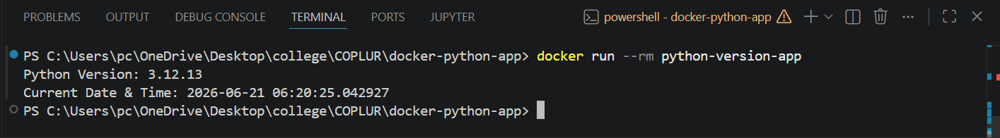

# Dockerized Python Application

This project demonstrates a simple Dockerized Python application using the official Python 3.12 slim image.

## Features

- Uses python:3.12-slim as base image
- Prints Python version
- Prints current date and time
- Runs automatically when container starts

## Project Structure

```text
docker-python-app/
│
├── app.py
├── Dockerfile
├── requirements.txt
└── README.md
```

## Build Docker Image

```bash
docker build -t python-version-app .
```

## Run Docker Container

```bash
docker run --rm python-version-app
```

## Sample Output

```text
Python Version: 3.12.11
Current Date & Time: 2026-06-21 10:15:32.123456
```

## Screenshot



## Author

Vishnu