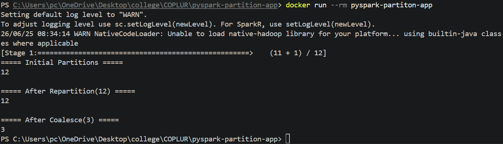

# PySpark Partition Management Application

## Objective

This project demonstrates partition management in PySpark using DataFrames.

The application performs the following operations:

* Generates a DataFrame containing 5 million records using `spark.range()`
* Displays the initial number of partitions
* Increases the number of partitions to 12 using `repartition()`
* Reduces the number of partitions to 3 using `coalesce()`

---

## Project Structure

```text
pyspark-partition-app/
│
├── app.py
├── Dockerfile
├── requirements.txt
├── README.md
└── Screenshot.png
```

---

## Technologies Used

* Python 3.12
* PySpark 3.5.1
* Apache Spark
* Java (JDK)
* Docker

---

## Source Code

### app.py

```python
from pyspark.sql import SparkSession

# Create Spark Session
spark = SparkSession.builder \
    .appName("PartitionDemo") \
    .getOrCreate()

# Generate 5 Million Records
df = spark.range(5000000)

# Initial Partitions
print("\n===== Initial Partitions =====")
print(df.rdd.getNumPartitions())

# Repartition to 12
df_repartition = df.repartition(12)

print("\n===== After Repartition(12) =====")
print(df_repartition.rdd.getNumPartitions())

# Coalesce to 3
df_coalesce = df_repartition.coalesce(3)

print("\n===== After Coalesce(3) =====")
print(df_coalesce.rdd.getNumPartitions())

spark.stop()
```

---

## Build Docker Image

Run the following command from the project directory:

```bash
docker build -t pyspark-partiton-app .
```

---

## Run Docker Container

```bash
docker run --rm pyspark-partiton-app
```

---

## Output

```text
===== Initial Partitions =====
12

===== After Repartition(12) =====
12

===== After Coalesce(3) =====
3
```

---

## Explanation

### spark.range(5000000)

Creates a DataFrame containing 5 million records with values ranging from 0 to 4,999,999.

### repartition(12)

Repartitions the DataFrame into 12 partitions. This operation can increase or decrease partitions and involves a full data shuffle.

### coalesce(3)

Reduces the number of partitions from 12 to 3. This operation is more efficient than repartition because it minimizes data movement.

### Note

The initial number of partitions may vary depending on the Spark configuration and available system resources. In this project, the initial partition count was 12.

---

## Screenshot

Add the execution screenshot here.

```markdown

```

---

## Author

Vishnu
